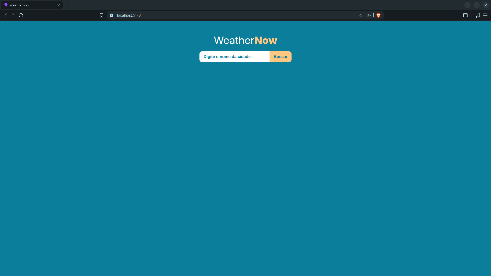
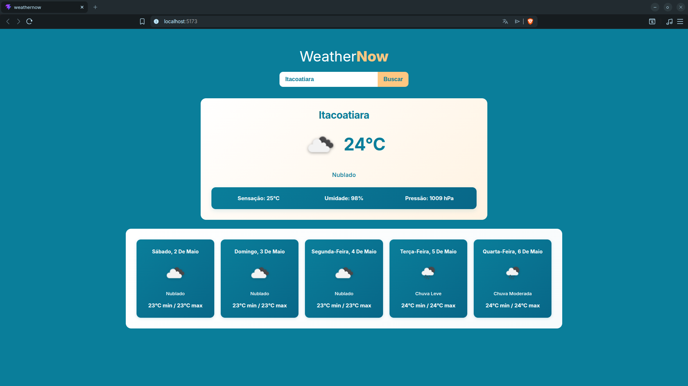

# WeatherNow ⛅

Um aplicativo de previsão do tempo moderno e responsivo, desenvolvido como **projeto de estudo** para consolidar conhecimentos em React, componentes reutilizáveis, consumo de APIs e estilização avançada com SCSS.

## ✅ Imagens do Projeto

### Tela Inicial:


### Tela de Previsão:



## 📋 Sobre o Projeto

**WeatherNow** é uma aplicação que permite aos usuários buscar informações climáticas em tempo real para qualquer cidade do mundo. O projeto foi criado com foco em boas práticas de desenvolvimento, estrutura de componentes, design responsivo e tratamento de erros.

### Objetivo de Aprendizado
- Consolidar conhecimentos em **React Hooks** (useState, useRef)
- Praticar consumo de APIs externas com **Axios**
- Implementar **design responsivo** com Grid CSS
- Criar componentes reutilizáveis e escaláveis
- Aplicar técnicas avançadas de **SCSS** e hierarquia tipográfica

## 🚀 Funcionalidades

- ✅ **Busca de Cidades** — Pesquise por qualquer cidade do mundo
- ✅ **Clima Atual** — Exibe temperatura, descrição, sensação térmica, umidade e pressão
- ✅ **Previsão de 5 Dias** — Cards com previsão por dia em grid responsivo
- ✅ **Ícones de Clima** — Ícones visuais dinâmicos da OpenWeatherMap
- ✅ **Design Responsivo** — Funciona perfeitamente em mobile, tablet e desktop

## 🛠️ Tecnologias Utilizadas

| Categoria | Tecnologia | Versão |
|-----------|-----------|--------|
| **Frontend Framework** | React | 19.2.5 |
| **Build Tool** | Vite | 8.0.10 |
| **HTTP Client** | Axios | 1.15.2 |
| **Estilização** | SCSS/Sass | 1.99.0 |

### APIs Utilizadas
- **OpenWeatherMap** — [https://openweathermap.org/api](https://openweathermap.org/api)
  - `Weather API` — Clima atual
  - `Forecast API` — Previsão de 5 dias

## 📦 Instalação & Uso

### Pré-requisitos
- Node.js (v16+)
- npm ou yarn

### Passo a Passo

1. **Clone ou navegue para o diretório:**
```bash
cd WeatherNow
```

2. **Instale as dependências:**
```bash
npm install
```

3. **Inicie o servidor de desenvolvimento:**
```bash
npm run dev
```

4. **Abra no navegador:**
```
http://localhost:5173
```
